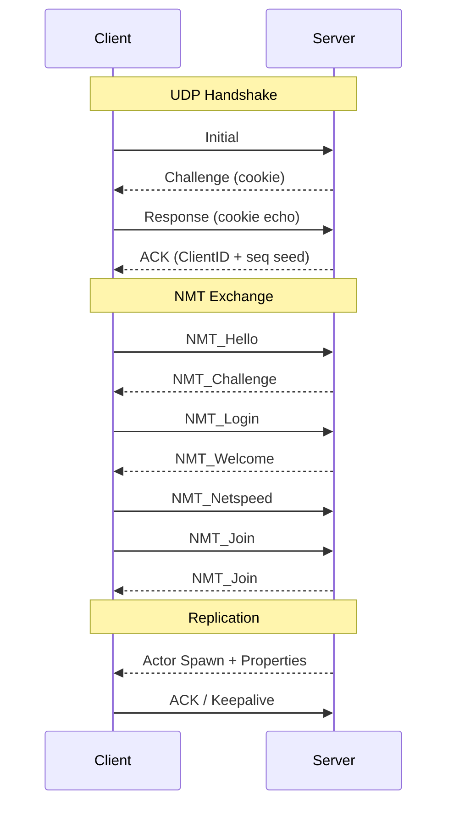
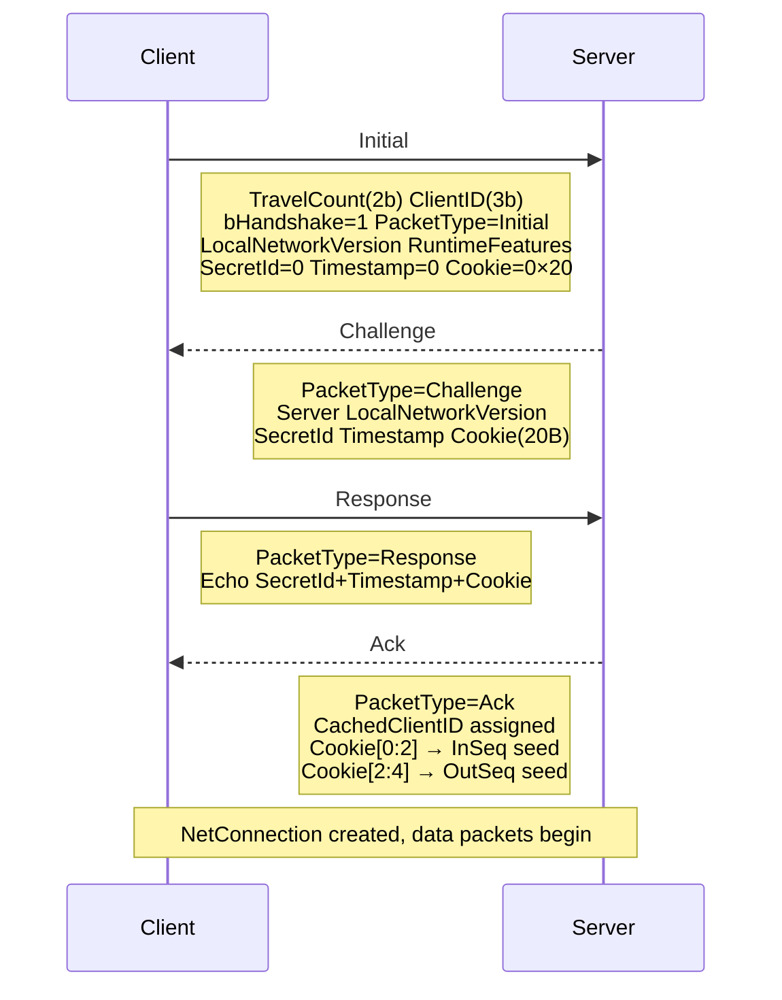

[ English | [한국어](README_KO.md) ]

# Lyra Bot

A headless game client implementing the Unreal Engine 5 network protocol in pure Python.
Connects to a UE5 Lyra Starter Game dedicated server and handles the full connection flow from handshake through login to actor replication.

## Requirements

- Python 3.10+
- UE5 Lyra Starter Game build — download from [Releases](https://github.com/Mokocoder/LyraStarterGame_Build/releases):
  - [`LyraServer.7z`](https://github.com/Mokocoder/LyraStarterGame_Build/releases/download/test-build/LyraServer.7z) — dedicated server
  - [`LyraGame.7z`](https://github.com/Mokocoder/LyraStarterGame_Build/releases/download/test-build/LyraGame.7z) — game client

## Quick Start

### 1. Start Server

Extract `LyraServer.7z` and run the dedicated server:

```bash
LyraServer.exe /ShooterMaps/Maps/L_Expanse -log -port=7777 -nosteam
```

### 2. Run Bot

```bash
cd client
python client.py                     # default: 127.0.0.1:7777
python client.py --ip 192.168.0.10   # remote server
python client.py --port 7778         # change port
```

A `client_YYYYMMDD_HHMMSS.log` file is automatically created, recording all sent/received packets and parsing results.

### 3. Shutdown

Press `Ctrl+C` for graceful shutdown. Sends a Disconnect packet to the server before closing the socket.

## Connection Flow



## Project Structure

```
Lyra/
├── client/                                  # Bot client source
│   ├── client.py                            # Main entry point
│   ├── app_config.py                        # LOCAL_NETWORK_VERSION, ONLINE_SUBSYSTEM_TYPE
│   ├── constants.py                         # Protocol constants (sequence, channel, engine version, etc.)
│   │
│   ├── core/                                # Core utilities
│   │   ├── log.py                           # File logger
│   │   └── names/                           # UE5 FName system
│   │       ├── ename.py                     # EName enum (hardcoded indices 0~1001+)
│   │       └── fname.py                     # FName pool — string ↔ index mapping
│   │
│   ├── serialization/                       # Bit-level serialization
│   │   ├── bit_reader.py                    # FBitReader — LSB-first bit reading
│   │   ├── bit_writer.py                    # FBitWriter — LSB-first bit writing
│   │   └── bit_util.py                      # Bit manipulation utils
│   │
│   └── net/                                 # Network protocol implementation
│       ├── connection.py                    # NetConnection — packet send/receive state machine
│       ├── net_serialization.py             # UE5 type serialization (Vector, Rotator, GUID, etc.)
│       ├── types.py                         # FVector, FRotator data classes
│       ├── error_reporter.py                # Parse error reporter
│       ├── packet_id_range.py               # Packet ID range tracking
│       │
│       ├── handlers/                        # Packet handler chain
│       │   ├── stateless_connect.py         # StatelessConnect — handshake + 6-bit prefix
│       │   └── aesgcm.py                    # AES-GCM (disabled)
│       │
│       ├── reliability/                     # Reliability layer
│       │   ├── packet_notify.py             # FNetPacketNotify — 32-bit packet header (seq/ack)
│       │   ├── sequence_number.py           # 14-bit wrapping sequence number
│       │   └── sequence_history.py          # 256-bit receive history bitmask
│       │
│       ├── packets/                         # Packet and bunch definitions
│       │   ├── in_bunch.py                  # FInBunch — incoming bunch (extends FBitReader)
│       │   ├── out_bunch.py                 # FOutBunch — outgoing bunch (extends FBitWriter)
│       │   └── control/                     # NMT (Net Control Message) types
│       │       ├── __init__.py              # NetControlMessageType enum, NMT namespace
│       │       ├── hello.py                 # NMT_Hello — client version send
│       │       ├── welcome.py               # NMT_Welcome — map/gamemode receive
│       │       ├── login.py                 # NMT_Login — player authentication
│       │       ├── join.py                  # NMT_Join — game join
│       │       ├── netspeed.py              # NMT_Netspeed — bandwidth setting
│       │       ├── failure.py               # NMT_Failure — connection rejected
│       │       └── closereason.py           # NMT_CloseReason — connection close reason
│       │
│       ├── channels/                        # Channel system
│       │   ├── channel_registry.py          # Channel type registry (Control, Actor, Voice)
│       │   ├── channel_types.py             # Channel type enumeration
│       │   ├── base_channel.py              # Base channel — partial bunch assembly, reliable sequences
│       │   ├── voice_channel.py             # Voice channel (disabled)
│       │   ├── control/
│       │   │   ├── channel.py               # Control channel — NMT message dispatch
│       │   │   └── core_handlers.py         # Challenge→Login, Welcome→Netspeed+Join, etc.
│       │   └── actor/
│       │       ├── channel.py               # Actor channel — spawn, replication, RPC
│       │       └── handlers/
│       │           └── class_path.py        # Class path based spawn processor
│       │
│       ├── replication/                     # Property replication system
│       │   ├── spawn_bunch.py               # Spawn bunch parsing (GUID, location, rotation, scale)
│       │   ├── content_block.py             # Content block iterator (including subobjects)
│       │   ├── rep_layout.py                # RepLayout — per-class property defs + deserialization
│       │   ├── rep_handle_map.py            # Handle→property mapping, struct serializers
│       │   ├── types.py                     # PropertyType enum, PropertyDef, RepLayoutTemplate
│       │   ├── custom_delta/
│       │   │   └── base.py                  # Custom delta handler base/registry
│       │   ├── templates/
│       │   │   └── game_state.py            # GameState server time sync callback
│       │   └── data/
│       │       └── rep_layout.json          # Per-class property defs (UE5_RepLayout_Extractor)
│       │
│       ├── guid/                            # Network GUID management
│       │   ├── package_map_client.py        # NetGUIDCache — GUID ↔ path mapping
│       │   ├── net_field_export.py          # Field name export tracking
│       │   ├── static_field_mapping.py      # Per-class field index mapping
│       │   └── data/
│       │       └── max_values.json          # Per-class SerializeInt max (UE5_ClassNetCache_Extractor)
│       │
│       ├── identity/                        # Player ID system
│       │   ├── unique_net_id.py             # FUniqueNetId — platform ID (NULL/STEAM/EOS, etc.)
│       │   └── unique_net_id_repl.py        # FUniqueNetIdRepl — serialization/deserialization
│       │
│       ├── state/                           # Per-connection state management
│       │   ├── session_state.py             # Session state (login params, player ID)
│       │   └── game_state.py                # Game state (server time)
│       │
│       └── rpc/                             # RPC system
│           └── base.py                      # RPCBase + RPCRegistry
│
├── example/                                 # Example output
│   └── client_20260224_004909.log           # Actual connection session log
│
└── .gitignore
```

## Protocol Details

### Bit Serialization

All network data is serialized at the bit level. Follows LSB-first order within each byte (bit 0 = 0x01, bit 7 = 0x80).

| Function | Description |
|----------|-------------|
| `SerializeInt(value, max)` | Variable length. Bit count determined by value range |
| `WriteIntWrapped(value, max)` | Fixed length. `ceil(log2(max))` bits. Identical to SerializeInt when max is power of 2 |
| `SerializeIntPacked` | Variable length. 7-bit chunks + 1-bit continuation flag |
| `SerializeBits(data, bits)` | Raw bit copy of fixed bit count |

### Packet Wire Format

Structure of UDP payloads exchanged between server/client:

```
[handler_prefix] [packet_header] [bunch_0] [bunch_1] ... [inner_term] ← Handler.Outgoing() → [outer_term] [zero_pad]
```

#### Handler Prefix (6 bits)

Prefix prepended by StatelessConnectHandlerComponent to all data packets:

```
[CachedGlobalNetTravelCount: 2 bits] [CachedClientID: 3 bits] [bHandshakePacket: 1 bit(=0)]
```

Handshake packets (`bHandshakePacket=1`) use a separate format, distinct from data packets.

#### Two-Level Terminator

Two 1-bit terminators are required for packet end detection:

1. Inner terminator — written before `Handler→Outgoing()` call in `_finalize_send_buffer()`. Marks end of FlushNet payload.
2. Outer terminator — written after `Handler→Outgoing()` call. Marks end of handler processing result.

Receiver strips in reverse order:
1. `received_raw_packet()`: strip outer terminator (`FBitUtil.strip_trailing_one`)
2. `handler.Incoming()`: strip handler prefix, extract data
3. `received_raw_packet()`: strip inner terminator (`FBitUtil.strip_trailing_one`)
4. `received_packet()`: begin actual packet processing

Missing inner terminator causes `ZeroLastByte` fault → server disconnects.

### Packet Header (32-bit fixed)

Packet header managed by `FNetPacketNotify`:

```
[Seq: 14 bits] [AckedSeq: 14 bits] [HistoryWordCount-1: 4 bits]
```

- Seq: this packet's sequence number (0~16383, wrapping)
- AckedSeq: last acknowledged remote packet sequence
- HistoryWordCount: number of 32-bit words of receive history bitmask that follows (1~8)

After the header, `HistoryWordCount × 32` bits of receive history follow. Each bit indicates received(1) or lost(0) for past packets.

Optional JitterClockTime info may follow the header (v14+):
```
[bHasPacketInfo: 1 bit] → [JitterClockTimeMS: SerializeInt(1024)] [bHasServerFrameTime: 1 bit] → [ServerFrameTime: 8 bits]
```

### Bunch

One or more bunches follow the packet header. Each bunch is a data unit for a specific channel.

#### Bunch Header

```
[bControl: 1]
  └ if 1: [bOpen: 1] [bClose: 1]
            └ if bClose: [CloseReason: SerializeInt(15)]
[bIsReplicationPaused: 1]
[bReliable: 1]
[ChIndex: UInt32Packed]
[bHasPackageMapExports: 1]
[bHasMustBeMappedGUIDs: 1]
[bPartial: 1]
  └ if 1: [bPartialInitial: 1] [bPartialCustomExportsFinal: 1] [bPartialFinal: 1]
[bReliable → ChSequence: WriteIntWrapped(MAX_CHSEQUENCE=1024)] ← 10-bit fixed, per-channel independent
[bOpen or bReliable → ChannelName: [bHardcoded: 1] → [PackedIndex] or [FString + Number]]
[PayloadBitCount: SerializeInt(MAX_BUNCH_DATA_BITS)]
[Payload: PayloadBitCount bits]
```

#### Channel Sequence

- Reliable: per-channel independent sequence 0~1023. Wrapping comparison via `MakeRelative(half=512, mod=1024)`.
- Unreliable Partial: uses packet sequence as bunch sequence.
- Unreliable Non-Partial: sequence 0 (ordering not required).

#### Partial Bunch Assembly

Large data is split across multiple bunches:

1. `bPartialInitial=1`: start new partial bunch, initialize buffer
2. Middle fragments: append data to existing buffer (byte alignment validation)
3. `bPartialFinal=1`: last fragment, assembly complete → process completed bunch

All fragments must share the same Reliable/Unreliable attribute and have consecutive sequences.

### Channel Processing

#### Control Channel (ChIndex=0)

Exchanges NMT (Net Control Message) messages:

| Step | Direction | Message | Content |
|------|-----------|---------|---------|
| 1 | C→S | `NMT_Hello` | `LocalNetworkVersion`, `EncryptionToken`, `RuntimeFeatures` |
| 2 | S→C | `NMT_Challenge` | Challenge string |
| 3 | C→S | `NMT_Login` | Challenge response, URL(`?Name=Player`), `FUniqueNetIdRepl`, platform name |
| 4 | S→C | `NMT_Welcome` | Map path, game mode class, redirect URL |
| 5 | C→S | `NMT_Netspeed` | Bandwidth declaration (default 1,200,000) |
| 6 | C→S | `NMT_Join` | Join request |
| 7 | S→C | `NMT_Join` | Join accepted → actor replication begins |

#### Actor Channel

Server-opened channel. Handles actor spawning and property replication.

Spawn bunch (`bOpen=1`):
```
[bHasMustBeMappedGUIDs → MustBeMappedGUIDs: uint16 count + GUID[]]
[ActorGUID: NetworkGUID]
[ArchetypeGUID: NetworkGUID]
[LevelGUID: NetworkGUID]
[Location: SpawnQuantizedVector]
[Rotation: CompressedRotation]
[Scale: Vector]
[Velocity: Vector]
→ followed by ContentBlocks for initial properties
```

Property update (`bOpen=0`):

Iterates update blocks via ContentBlock iterator:

```
ContentBlock:
  [bHasRepLayout: 1] [bIsActor: 1]
  └ if bIsActor: properties of this actor itself
  └ else:
    [ObjectGUID: InternalLoadObject]
    [bStablyNamed: 1]
    └ if 0:
      [v30+ → bIsDestroy: 1 → DeleteFlag]
      [ClassGUID: InternalLoadObject]
      [v18+ → bActorIsOuter: 1 → OuterGUID]
  [PayloadBits: UInt32Packed]
  [Payload: PayloadBits bits]
```

Inside payload:
1. RepLayout properties (`bHasRepLayout=1`): read handle via `ReadUInt32Packed`, look up `PropertyDef` for the class in `rep_layout.json`, invoke type-specific deserializer
2. Dynamic fields (remaining bits after RepLayout): read field index via `SerializeInt(field_max+1)`, bit count via `UInt32Packed`, map using `max_values.json` for RPC/CustomDelta processing

### Handshake

4-way handshake for UDP connection establishment:



### Reliability System

When the receiver gets a packet:
1. Read `Seq`, `AckedSeq`, `History` from packet header
2. Use `AckedSeq` to determine delivery success/failure of sender's packets (referencing History bitmask)
3. Use `Seq` to determine if new packet (`Seq > InSeq` means new)
4. After bunch processing, call `ack_seq(Seq)` or `nak_seq(Seq)`
5. Include updated `AckedSeq` and `History` in next outgoing packet header

If reliable bunches arrive out of order, they are buffered in the `in_rec` dictionary and processed in order once the missing sequence arrives.

## Data Files

JSON files in `data/` directories are auto-extracted from the UE5 project. To apply to other projects, regenerate with the tools below:

| File | Generation Tool |
|------|-----------------|
| `rep_layout.json` | [UE5_RepLayout_Extractor](https://github.com/Mokocoder/UE5_RepLayout_Extractor) |
| `max_values.json` | [UE5_ClassNetCache_Extractor](https://github.com/Mokocoder/UE5_ClassNetCache_Extractor) |

## Example Log

`example/client_20260224_004909.log` contains the full log of an actual connection session:

```
[->] Init               (48) a00102000098e40f32...
[<-] Challenge          (50) a00182000098e40f32...
[->] Challenge Response (51) a00102810098e40f32...
[<-] Challenge Ack      (51) a00182810098e40f32...
[INFO] CachedClientID: 0
[INFO] InSeq: 8965, OutSeq: 4611
[->] NMT_Hello          (31) 00108c0312000000c0...

============================================================
Connected! Listening...
============================================================

[<-] Server             (32) 0008480523000000c0...
[->] Response           (52) 00108c041200000040...
...
[REPLAYOUT] Auto-registered LyraPlayerState (32 defs, 32 total handles)
[REPLAYOUT] LyraPlayerState OK handles=[5, 13, 14, ...] props={RemoteRole=1, ...}
[REPLAYOUT] B_Hero_ShooterMannequin_C OK handles=[...] props={RemoteRole=1,
    ReplicatedMovement={'Location': FVector(2919.94, -1122.85, -443.96), ...}, ...}
```

## Extensions

### Register Spawn Processor

```python
from net.channels.actor.channel import ActorChannel

def on_player_spawn(spawn_data, connection):
    print(f"Player spawned: {spawn_data.class_name}")

ActorChannel.register_spawn_processor("B_Hero_ShooterMannequin_C", on_player_spawn)
```

### Register RPC Handler

```python
from net.rpc.base import RPCRegistry

class MyRPCHandler(RPCBase):
    def parse(self, reader):
        # Deserialize RPC parameters
        pass

RPCRegistry.register("MyFunction", MyRPCHandler)
```

### RepLayout Template

```python
# Add new file under net/replication/templates/
from net.replication.types import RepLayoutTemplate

def on_update(props, connection):
    if 'Health' in props:
        print(f"Health changed: {props['Health']}")

TEMPLATES = [
    RepLayoutTemplate(
        match=lambda name: 'HealthComponent' in name,
        on_update=on_update,
    ),
]
```

## Limitations

- Receive-only: client input, movement, and RPC sending are not implemented
- No encryption: cannot connect to servers with AES-GCM/DTLS enabled
- Some structs unsupported: `GameplayAbilitySpecContainer`, `ActiveGameplayEffectsContainer`, `GameplayTagStackContainer` and other GAS-related complex struct deserializers are missing
- Single connection: concurrent multi-connection is not supported

## License

This project is created for educational and research purposes.
It is a reference implementation for understanding and learning the UE5 network protocol.

Commercial use is prohibited. This code may not be used in for-profit products, services, or revenue-generating activities.
