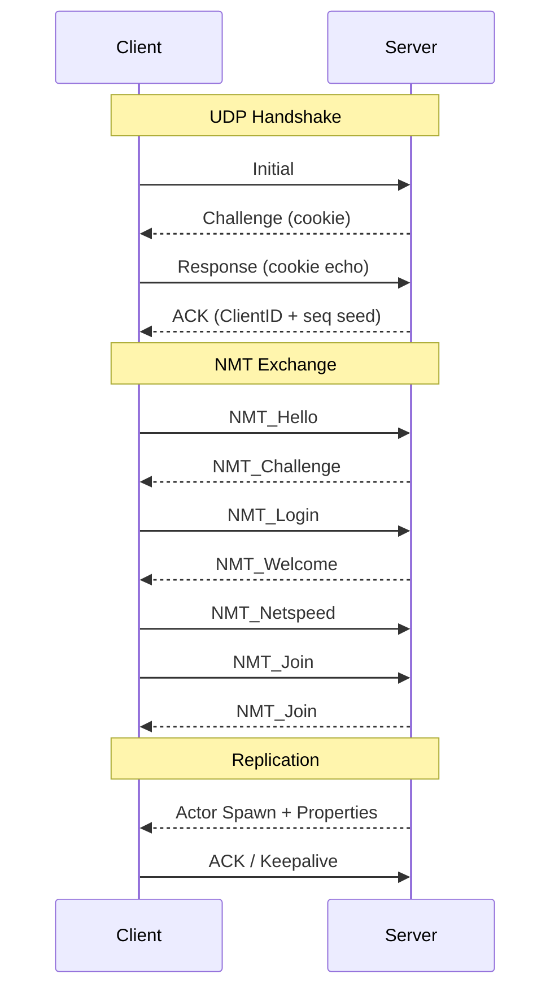
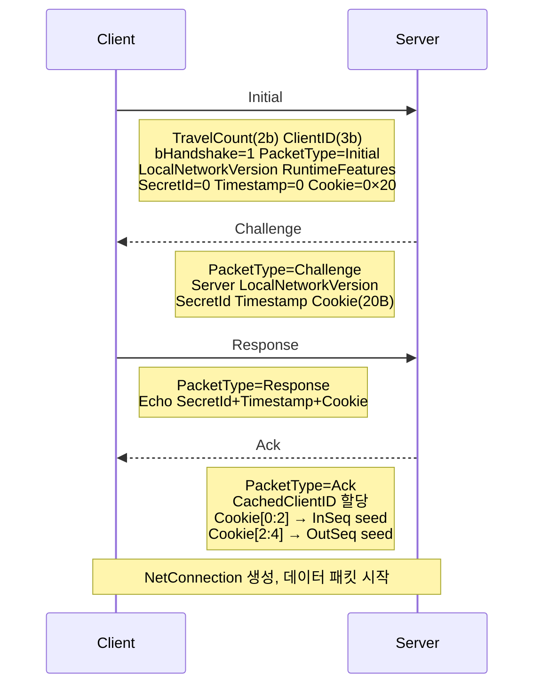

[ [English](README.md) | 한국어 ]

# UE5_python_client

Unreal Engine 5 네트워크 프로토콜을 순수 Python으로 구현한 헤드리스 게임 클라이언트입니다.
UE5 Lyra Starter Game 전용 서버에 접속하여 핸드셰이크, 로그인, 액터 리플리케이션까지의 전체 연결 흐름을 처리합니다.

## 데모

[](https://youtu.be/qLgJLLM0T5s)

## 목차

- [요구 사항](#요구-사항)
- [빠른 시작](#빠른-시작)
  - [1. 서버 실행](#1-서버-실행)
  - [2. 실행](#2-실행)
  - [3. 종료](#3-종료)
- [연결 흐름](#연결-흐름)
- [프로젝트 구조](#프로젝트-구조)
- [프로토콜 상세](#프로토콜-상세)
  - [비트 직렬화](#비트-직렬화)
  - [패킷 와이어 포맷](#패킷-와이어-포맷)
    - [핸들러 프리픽스 (6비트)](#핸들러-프리픽스-6비트)
    - [2단계 터미네이터](#2단계-터미네이터)
    - [패킷 헤더 (32비트 고정)](#패킷-헤더-32비트-고정)
    - [번치 (Bunch)](#번치-bunch)
  - [채널 처리](#채널-처리)
    - [Control 채널 (ChIndex=0)](#control-채널-chindex0)
    - [Actor 채널](#actor-채널)
  - [핸드셰이크](#핸드셰이크)
  - [신뢰성 시스템](#신뢰성-시스템)
- [데이터 파일](#데이터-파일)
- [예제 로그](#예제-로그)
- [확장](#확장)
  - [스폰 프로세서 등록](#스폰-프로세서-등록)
  - [RPC 핸들러 등록](#rpc-핸들러-등록)
  - [RepLayout 템플릿](#replayout-템플릿)
- [제약 사항](#제약-사항)
- [라이선스](#라이선스)

## 요구 사항

- Python 3.10+
- UE5 Lyra Starter Game 빌드 — [Releases](https://github.com/Mokocoder/LyraStarterGame_Build/releases)에서 다운로드:
  - [`LyraServer.7z`](https://github.com/Mokocoder/LyraStarterGame_Build/releases/download/test-build/LyraServer.7z) — 전용 서버
  - [`LyraGame.7z`](https://github.com/Mokocoder/LyraStarterGame_Build/releases/download/test-build/LyraGame.7z) — 게임 클라이언트

## 빠른 시작

### 1. 서버 실행

`LyraServer.7z`를 압축 해제한 후 전용 서버를 실행합니다:

```bash
LyraServer.exe /ShooterMaps/Maps/L_Expanse -log -port=7777 -nosteam
```

### 2. 실행

```bash
cd client
python client.py                     # 기본값: 127.0.0.1:7777
python client.py --ip 192.168.0.10   # 원격 서버
python client.py --port 7778         # 포트 변경
```

실행 시 `client_YYYYMMDD_HHMMSS.log` 파일이 자동 생성되어 모든 송수신 패킷과 파싱 결과가 기록됩니다.

### 3. 종료

`Ctrl+C`로 정상 종료합니다. 서버에 Disconnect 패킷을 전송한 후 소켓을 닫습니다.

## 연결 흐름



## 프로젝트 구조

```
Lyra/
├── client/                                  # 클라이언트 소스
│   ├── client.py                            # 메인 진입점
│   ├── app_config.py                        # LOCAL_NETWORK_VERSION, ONLINE_SUBSYSTEM_TYPE
│   ├── constants.py                         # 프로토콜 상수 (시퀀스, 채널, 엔진 버전 등)
│   │
│   ├── core/                                # 핵심 유틸리티
│   │   ├── log.py                           # 파일 로거
│   │   └── names/                           # UE5 FName 시스템
│   │       ├── ename.py                     # EName 열거형 (하드코딩된 인덱스 0~1001+)
│   │       └── fname.py                     # FName 풀 — 문자열 ↔ 인덱스 매핑
│   │
│   ├── serialization/                       # 비트 레벨 직렬화
│   │   ├── bit_reader.py                    # FBitReader — LSB-first 비트 읽기
│   │   ├── bit_writer.py                    # FBitWriter — LSB-first 비트 쓰기
│   │   └── bit_util.py                      # 비트 조작 유틸
│   │
│   └── net/                                 # 네트워크 프로토콜 구현
│       ├── connection.py                    # NetConnection — 패킷 수신/송신 상태 관리
│       ├── net_serialization.py             # UE5 타입 직렬화 (Vector, Rotator, GUID 등)
│       ├── types.py                         # FVector, FRotator 데이터 클래스
│       ├── error_reporter.py                # 파싱 에러 리포터
│       ├── packet_id_range.py               # 패킷 ID 범위 추적
│       │
│       ├── handlers/                        # 패킷 핸들러 체인
│       │   ├── stateless_connect.py         # StatelessConnect — 핸드셰이크 + 6비트 프리픽스
│       │   └── aesgcm.py                    # AES-GCM (비활성)
│       │
│       ├── reliability/                     # 신뢰성 계층
│       │   ├── packet_notify.py             # FNetPacketNotify — 32비트 패킷 헤더 (seq/ack)
│       │   ├── sequence_number.py           # 14비트 래핑 시퀀스 번호
│       │   └── sequence_history.py          # 256비트 수신 이력 비트마스크
│       │
│       ├── packets/                         # 패킷 및 번치 정의
│       │   ├── in_bunch.py                  # FInBunch — 수신 번치 (FBitReader 확장)
│       │   ├── out_bunch.py                 # FOutBunch — 송신 번치 (FBitWriter 확장)
│       │   └── control/                     # NMT (Net Control Message) 타입
│       │       ├── __init__.py              # NetControlMessageType 열거형, NMT 네임스페이스
│       │       ├── hello.py                 # NMT_Hello — 클라이언트 버전 전송
│       │       ├── welcome.py               # NMT_Welcome — 맵/게임모드 수신
│       │       ├── login.py                 # NMT_Login — 플레이어 인증
│       │       ├── join.py                  # NMT_Join — 게임 진입
│       │       ├── netspeed.py              # NMT_Netspeed — 대역폭 설정
│       │       ├── failure.py               # NMT_Failure — 연결 거부
│       │       └── closereason.py           # NMT_CloseReason — 연결 종료 사유
│       │
│       ├── channels/                        # 채널 시스템
│       │   ├── channel_registry.py          # 채널 타입 레지스트리 (Control, Actor, Voice)
│       │   ├── channel_types.py             # 채널 타입 열거
│       │   ├── base_channel.py              # 기본 채널 — 부분 번치 조립, 신뢰성 시퀀스
│       │   ├── voice_channel.py             # Voice 채널 (비활성)
│       │   ├── control/
│       │   │   ├── channel.py               # Control 채널 — NMT 메시지 디스패치
│       │   │   └── core_handlers.py         # Challenge→Login, Welcome→Netspeed+Join 등
│       │   └── actor/
│       │       ├── channel.py               # Actor 채널 — 스폰, 리플리케이션, RPC
│       │       └── handlers/
│       │           └── class_path.py        # 클래스 경로 기반 스폰 프로세서
│       │
│       ├── replication/                     # 프로퍼티 리플리케이션 시스템
│       │   ├── spawn_bunch.py               # 스폰 번치 파싱 (GUID, 위치, 회전, 스케일)
│       │   ├── content_block.py             # 콘텐츠 블록 반복자 (서브오브젝트 포함)
│       │   ├── rep_layout.py                # RepLayout — 클래스별 프로퍼티 정의 + 역직렬화
│       │   ├── rep_handle_map.py            # 핸들→프로퍼티 매핑, 구조체 직렬화기
│       │   ├── types.py                     # PropertyType 열거형, PropertyDef, RepLayoutTemplate
│       │   ├── custom_delta/
│       │   │   └── base.py                  # 커스텀 델타 핸들러 베이스/레지스트리
│       │   ├── templates/
│       │   │   └── game_state.py            # GameState 서버 시간 동기화 콜백
│       │   └── data/
│       │       └── rep_layout.json          # 클래스별 프로퍼티 정의 (RepSeedDumper + RepSeedResolver)
│       │
│       ├── guid/                            # 네트워크 GUID 관리
│       │   ├── package_map_client.py        # NetGUIDCache — GUID ↔ 경로 매핑
│       │   ├── net_field_export.py          # 필드 이름 export 추적
│       │   ├── static_field_mapping.py      # 클래스별 필드 인덱스 매핑
│       │   └── data/
│       │       └── class_net_cache.json     # 클래스별 넷 필드 export (RepSeedDumper + RepSeedResolver)
│       │
│       ├── identity/                        # 플레이어 ID 시스템
│       │   ├── unique_net_id.py             # FUniqueNetId — 플랫폼 ID (NULL/STEAM/EOS 등)
│       │   └── unique_net_id_repl.py        # FUniqueNetIdRepl — 직렬화/역직렬화
│       │
│       ├── state/                           # 연결별 상태 관리
│       │   ├── session_state.py             # 세션 상태 (로그인 파라미터, 플레이어 ID)
│       │   └── game_state.py                # 게임 상태 (서버 시간)
│       │
│       └── rpc/                             # RPC 시스템
│           └── base.py                      # RPCBase + RPCRegistry
│
├── example/                                 # 예제 출력
│   └── client_20260227_204023.log           # 실제 연결 세션 로그 (패킷 + 리플리케이션 결과)
│
└── .gitignore
```

## 프로토콜 상세

### 비트 직렬화

모든 네트워크 데이터는 비트 단위로 직렬화됩니다. 각 바이트 내에서 LSB-first 순서(bit 0 = 0x01, bit 7 = 0x80)를 따릅니다.

| 함수 | 설명 |
|------|------|
| `SerializeInt(value, max)` | 가변 길이. 값 범위에 따라 비트 수 자동 결정 |
| `WriteIntWrapped(value, max)` | 고정 길이. `ceil(log2(max))` 비트. max가 2의 거듭제곱일 때 SerializeInt와 동일 |
| `SerializeIntPacked` | 가변 길이. 7비트 청크 + 1비트 연속 플래그 |
| `SerializeBits(data, bits)` | 고정 비트 수만큼 원시 비트 복사 |

### 패킷 와이어 포맷

서버/클라이언트 간 교환되는 UDP 패이로드의 구조:

```
[handler_prefix] [packet_header] [bunch_0] [bunch_1] ... [inner_term] ← Handler.Outgoing() → [outer_term] [zero_pad]
```

#### 핸들러 프리픽스 (6비트)

StatelessConnectHandlerComponent가 모든 데이터 패킷 앞에 붙이는 프리픽스:

```
[CachedGlobalNetTravelCount: 2비트] [CachedClientID: 3비트] [bHandshakePacket: 1비트(=0)]
```

핸드셰이크 패킷(`bHandshakePacket=1`)은 별도 형식이며, 데이터 패킷과 구분됩니다.

#### 2단계 터미네이터

패킷 끝 감지를 위해 두 개의 1-bit 터미네이터가 필요합니다:

1. 내부 터미네이터 — `_finalize_send_buffer()`에서 `Handler→Outgoing()` 호출 전 기록. FlushNet 페이로드의 끝을 표시.
2. 외부 터미네이터 — `Handler→Outgoing()` 호출 후 기록. 핸들러 처리 결과의 끝을 표시.

수신 측은 역순으로 제거합니다:
1. `received_raw_packet()`: 외부 터미네이터 제거 (`FBitUtil.strip_trailing_one`)
2. `handler.Incoming()`: 핸들러 프리픽스 제거, 데이터 추출
3. `received_raw_packet()`: 내부 터미네이터 제거 (`FBitUtil.strip_trailing_one`)
4. `received_packet()`: 실제 패킷 처리 시작

내부 터미네이터가 누락되면 `ZeroLastByte` 폴트 → 서버가 연결을 끊습니다.

#### 패킷 헤더 (32비트 고정)

`FNetPacketNotify`가 관리하는 패킷 헤더:

```
[Seq: 14비트] [AckedSeq: 14비트] [HistoryWordCount-1: 4비트]
```

- Seq: 이 패킷의 시퀀스 번호 (0~16383, 래핑)
- AckedSeq: 마지막으로 수신 확인된 상대방 패킷 시퀀스
- HistoryWordCount: 이어지는 수신 이력 비트마스크의 32비트 워드 수 (1~8)

헤더 뒤에 `HistoryWordCount × 32`비트의 수신 이력이 따라옵니다. 각 비트는 과거 패킷의 수신(1) 또는 손실(0)을 나타냅니다.

헤더 이후 선택적으로 JitterClockTime 정보가 올 수 있습니다 (v14+):
```
[bHasPacketInfo: 1비트] → [JitterClockTimeMS: SerializeInt(1024)] [bHasServerFrameTime: 1비트] → [ServerFrameTime: 8비트]
```

#### 번치 (Bunch)

패킷 헤더 뒤에 하나 이상의 번치가 연속됩니다. 각 번치는 특정 채널에 대한 데이터 단위입니다.

##### 번치 헤더

```
[bControl: 1]
  └ if 1: [bOpen: 1] [bClose: 1]
            └ if bClose: [CloseReason: SerializeInt(15)]
[bIsReplicationPaused: 1]
[bReliable: 1]
[ChIndex: UInt32Packed]
[bHasPackageMapExports: 1]
[bHasMustBeMappedGUIDs: 1]
[bPartial: 1]
  └ if 1: [bPartialInitial: 1] [bPartialCustomExportsFinal: 1] [bPartialFinal: 1]
[bReliable → ChSequence: WriteIntWrapped(MAX_CHSEQUENCE=1024)] ← 10비트 고정, 채널별 독립
[bOpen or bReliable → ChannelName: [bHardcoded: 1] → [PackedIndex] or [FString + Number]]
[PayloadBitCount: SerializeInt(MAX_BUNCH_DATA_BITS)]
[Payload: PayloadBitCount 비트]
```

##### 채널 시퀀스

- Reliable: 채널별 0~1023 독립 시퀀스. `MakeRelative(half=512, mod=1024)`로 래핑 비교.
- Unreliable Partial: 패킷 시퀀스를 번치 시퀀스로 사용.
- Unreliable Non-Partial: 시퀀스 0 (순서 보장 불필요).

##### 부분 번치 조립 (Partial Bunch)

큰 데이터는 여러 번치로 분할됩니다:

1. `bPartialInitial=1`: 새 부분 번치 시작, 버퍼 초기화
2. 중간 조각들: 기존 버퍼에 데이터 추가 (바이트 정렬 검증)
3. `bPartialFinal=1`: 마지막 조각, 조립 완료 → 완성된 번치를 처리

모든 조각은 같은 Reliable/Unreliable 속성을 가져야 하며, 시퀀스가 연속적이어야 합니다.

### 채널 처리

#### Control 채널 (ChIndex=0)

NMT(Net Control Message) 메시지를 교환합니다:

| 단계 | 방향 | 메시지 | 내용 |
|------|------|--------|------|
| 1 | C→S | `NMT_Hello` | `LocalNetworkVersion`, `EncryptionToken`, `RuntimeFeatures` |
| 2 | S→C | `NMT_Challenge` | 챌린지 문자열 |
| 3 | C→S | `NMT_Login` | 챌린지 응답, URL(`?Name=Player`), `FUniqueNetIdRepl`, 플랫폼 이름 |
| 4 | S→C | `NMT_Welcome` | 맵 경로, 게임 모드 클래스, 리다이렉트 URL |
| 5 | C→S | `NMT_Netspeed` | 대역폭 선언 (기본 1,200,000) |
| 6 | C→S | `NMT_Join` | 게임 진입 요청 |
| 7 | S→C | `NMT_Join` | 진입 승인 → 액터 리플리케이션 시작 |

#### Actor 채널

서버가 열어주는 채널. 액터 스폰과 프로퍼티 리플리케이션을 처리합니다.

스폰 번치 (`bOpen=1`):
```
[bHasMustBeMappedGUIDs → MustBeMappedGUIDs: uint16 count + GUID[]]
[ActorGUID: NetworkGUID]
[ArchetypeGUID: NetworkGUID]
[LevelGUID: NetworkGUID]
[Location: SpawnQuantizedVector]
[Rotation: CompressedRotation]
[Scale: Vector]
[Velocity: Vector]
→ 이후 ContentBlock으로 초기 프로퍼티 전달
```

프로퍼티 업데이트 (`bOpen=0`):

ContentBlock 반복자로 업데이트 블록을 순회합니다:

```
ContentBlock:
  [bHasRepLayout: 1] [bIsActor: 1]
  └ if bIsActor: 이 액터 자체의 프로퍼티
  └ else:
    [ObjectGUID: InternalLoadObject]
    [bStablyNamed: 1]
    └ if 0:
      [v30+ → bIsDestroy: 1 → DeleteFlag]
      [ClassGUID: InternalLoadObject]
      [v18+ → bActorIsOuter: 1 → OuterGUID]
  [PayloadBits: UInt32Packed]
  [Payload: PayloadBits 비트]
```

Payload 안에서:
1. RepLayout 프로퍼티 (`bHasRepLayout=1`): `ReadUInt32Packed`로 핸들을 읽고, `rep_layout.json`에서 해당 클래스의 `PropertyDef`를 찾아 타입별 역직렬화기를 호출
2. 동적 필드 (RepLayout 이후 남은 비트): `SerializeInt(field_max+1)`로 필드 인덱스, `UInt32Packed`로 비트 수를 읽고, `class_net_cache.json`으로 매핑하여 RPC/CustomDelta 처리

### 핸드셰이크

UDP 연결 수립을 위한 4-way 핸드셰이크:



### 신뢰성 시스템

수신 측이 패킷을 받으면:
1. 패킷 헤더에서 `Seq`, `AckedSeq`, `History` 읽기
2. `AckedSeq`로 송신 측 패킷의 배달 성공/실패 판정 (History 비트마스크 참조)
3. `Seq`로 새 패킷 여부 판정 (`Seq > InSeq`이면 새 패킷)
4. 번치 처리 후 `ack_seq(Seq)` 또는 `nak_seq(Seq)` 호출
5. 다음 송신 패킷 헤더에 갱신된 `AckedSeq`와 `History` 포함

Reliable 번치가 순서대로 도착하지 않으면 `in_rec` 딕셔너리에 버퍼링하고, 빠진 시퀀스가 도착하면 순서대로 처리합니다.

## 데이터 파일

`data/` 디렉터리의 JSON은 2단계 파이프라인으로 UE5 프로젝트에서 생성한 데이터입니다:

1. **[RepSeedDumper](https://github.com/Mokocoder/RepSeedDumper)** — 실행 중인 UE 프로세스에 DLL을 인젝션하여 C++ 네이티브 클래스의 리플리케이션 시드(`replication_seed.json`)를 추출합니다.
2. **[RepSeedResolver](https://github.com/Mokocoder/RepSeedResolver)** — `.pak` 파일을 스캔하고 시드 데이터를 사용하여 블루프린트 클래스의 리플리케이션 핸들과 ClassNetCache 인덱스를 해석합니다.

| 파일 | 설명 |
|------|------|
| `rep_layout.json` | 클래스별 리플리케이션 프로퍼티 핸들 (C++ 시드 + BP 프로퍼티) |
| `class_net_cache.json` | 클래스별 넷 필드 export 인덱스 (RPC/CustomDelta 해석용) |

## 예제 로그

`example/client_20260227_204023.log`에 실제 연결 세션의 전체 로그가 포함되어 있습니다:

```
[->] Init               (48) a00102000098e40f32...
[<-] Challenge          (50) a00182000098e40f32...
[->] Challenge Response (51) a00102810098e40f32...
[<-] Challenge Ack      (51) a00182810098e40f32...
[INFO] CachedClientID: 0
[INFO] InSeq: 8965, OutSeq: 4611
[->] NMT_Hello          (31) 00108c0312000000c0...

============================================================
Connected! Listening...
============================================================

[<-] Server             (32) 0008480523000000c0...
[->] Response           (52) 00108c041200000040...
...
[REPLAYOUT] Auto-registered LyraPlayerState (32 defs, 32 total handles)
[REPLAYOUT] LyraPlayerState OK handles=[5, 13, 14, ...] props={RemoteRole=1, ...}
[REPLAYOUT] B_Hero_ShooterMannequin_C OK handles=[...] props={RemoteRole=1,
    ReplicatedMovement={'Location': FVector(2919.94, -1122.85, -443.96), ...}, ...}
```

## 확장

### 스폰 프로세서 등록

```python
from net.channels.actor.channel import ActorChannel

def on_player_spawn(spawn_data, connection):
    print(f"Player spawned: {spawn_data.class_name}")

ActorChannel.register_spawn_processor("B_Hero_ShooterMannequin_C", on_player_spawn)
```

### RPC 핸들러 등록

```python
from net.rpc.base import RPCRegistry

class MyRPCHandler(RPCBase):
    def parse(self, reader):
        # RPC 파라미터 역직렬화
        pass

RPCRegistry.register("MyFunction", MyRPCHandler)
```

### RepLayout 템플릿

```python
# net/replication/templates/ 에 새 파일 추가
from net.replication.types import RepLayoutTemplate

def on_update(props, connection):
    if 'Health' in props:
        print(f"Health changed: {props['Health']}")

TEMPLATES = [
    RepLayoutTemplate(
        match=lambda name: 'HealthComponent' in name,
        on_update=on_update,
    ),
]
```

## 제약 사항

- 암호화 미지원: AES-GCM/DTLS가 활성화된 서버에는 접속할 수 없습니다
- 일부 구조체 미지원: `GameplayAbilitySpecContainer`, `ActiveGameplayEffectsContainer`, `GameplayTagStackContainer` 등 GAS 관련 복합 구조체의 역직렬화기가 없습니다
- 단일 연결: 동시 다중 접속은 지원하지 않습니다

## 라이선스

이 프로젝트는 교육 및 연구 목적으로 작성되었습니다.
UE5 네트워크 프로토콜의 이해와 학습을 위한 참고 구현입니다.

상업적 이용을 금지합니다. 이 코드를 영리 목적의 제품, 서비스, 또는 수익 창출 활동에 사용할 수 없습니다.
